# Architecture Diagrams for Vacancy Portal

## Overview

This document contains diagrams at various levels of abstraction to help conceptualize the Clean Architecture implementation for the Vacancy Portal.

## 1. High-Level Architecture Overview

### Current vs. Target Architecture

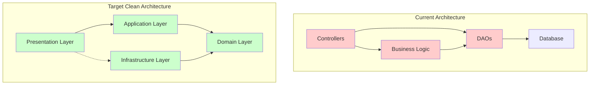

### Dependency Flow

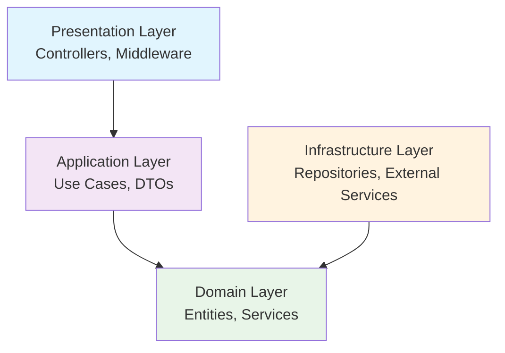

## 2. Layer Details

### Domain Layer Structure

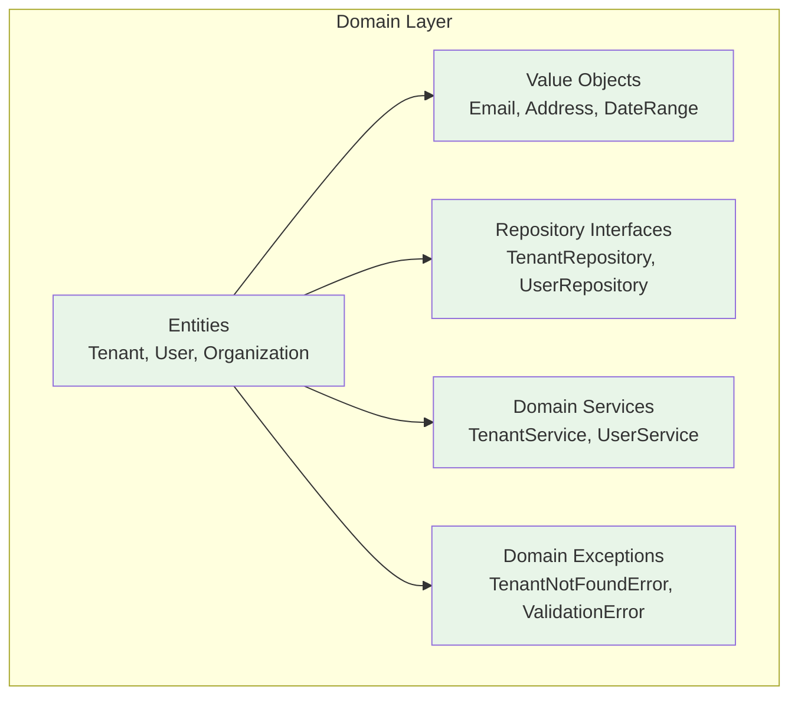

### Application Layer Structure

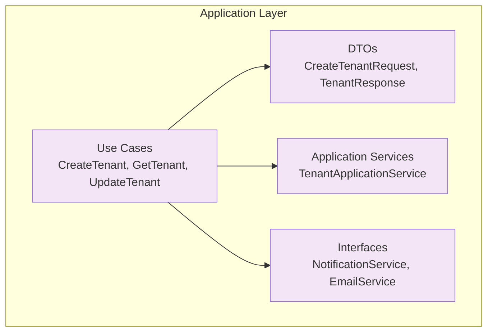

### Infrastructure Layer Structure

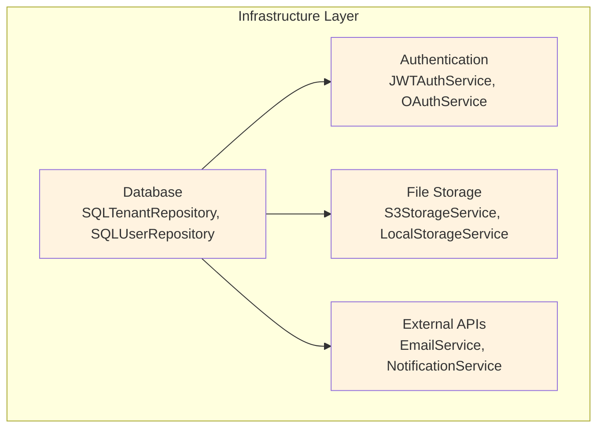

### Presentation Layer Structure

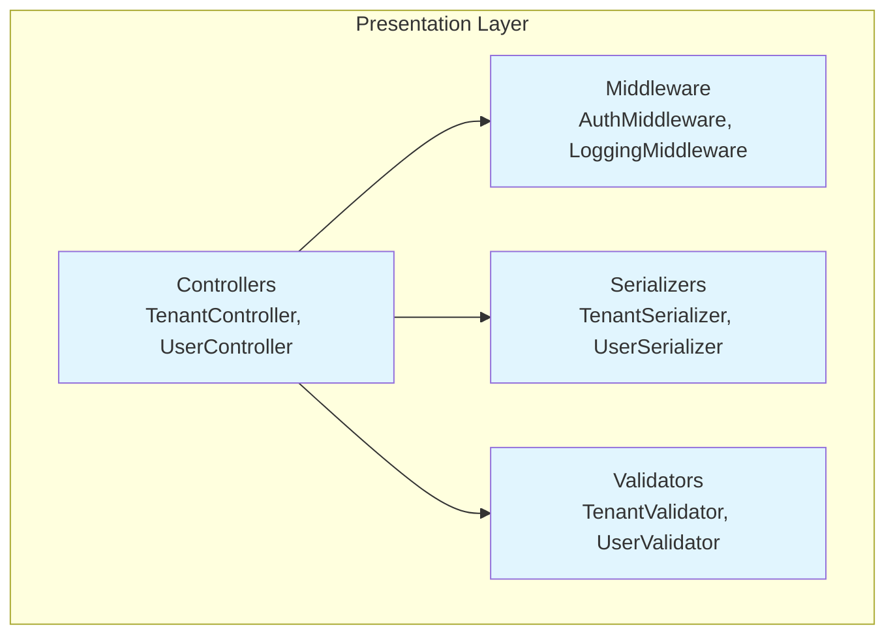

## 3. Detailed Component Interactions

### Tenant Management Flow

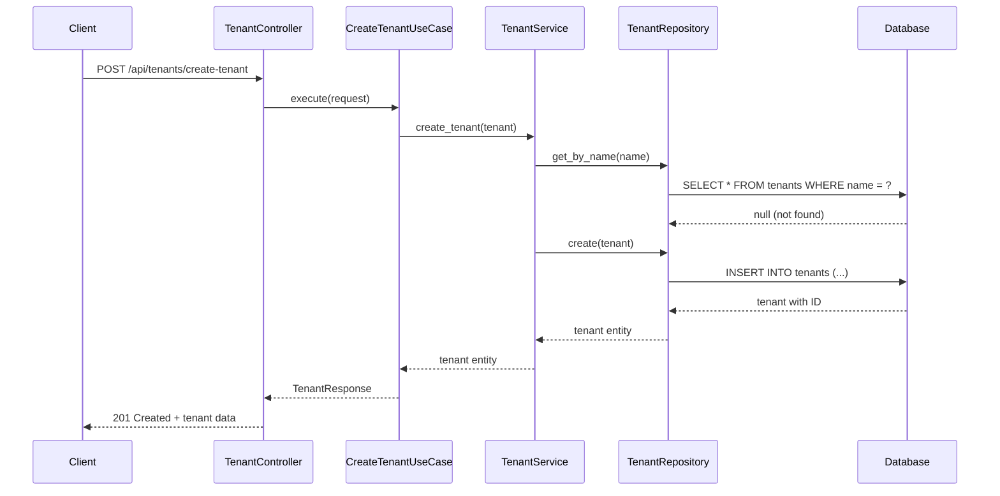

### Authentication Flow

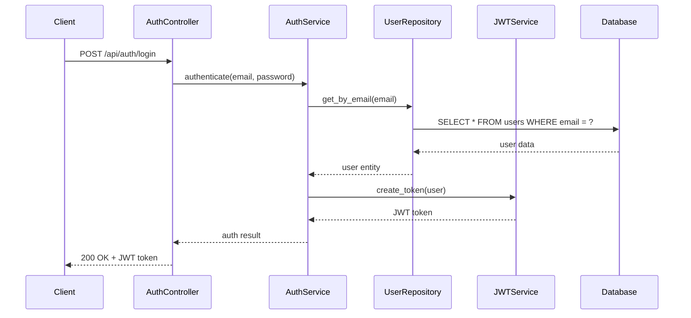

## 4. Database Schema Evolution

### Current Schema

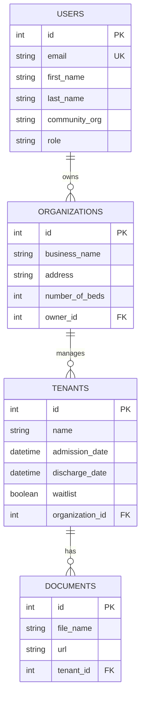

### Enhanced Schema (Future)

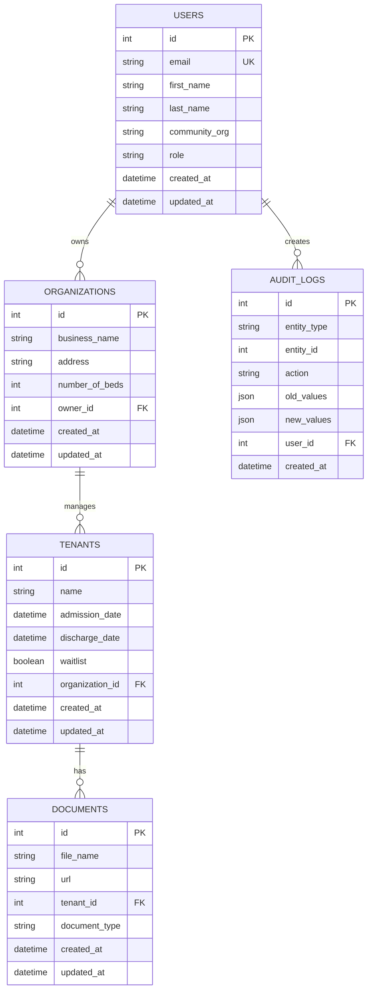

## 5. Dependency Injection Container

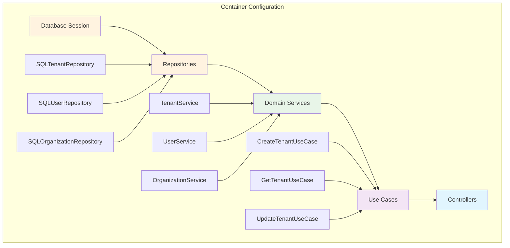

## 6. Migration Strategy Visualization

### Phase-by-Phase Migration

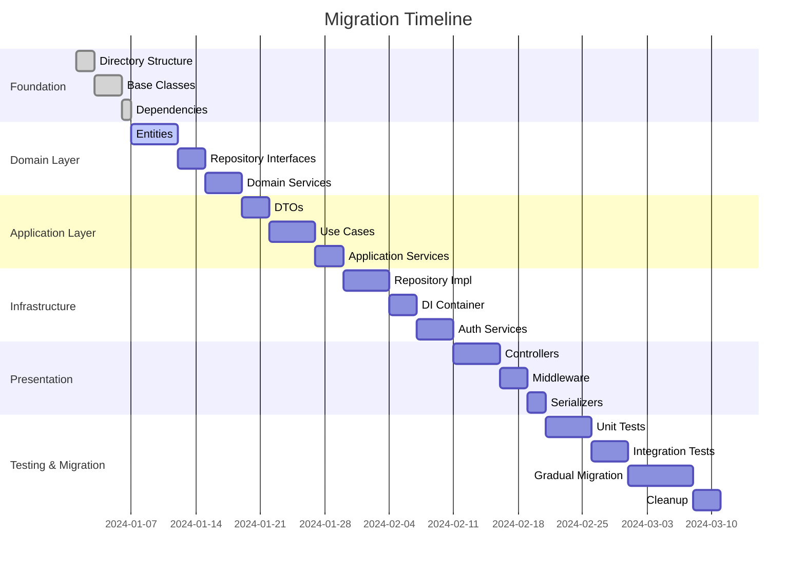

## 7. Testing Strategy

### Testing Pyramid

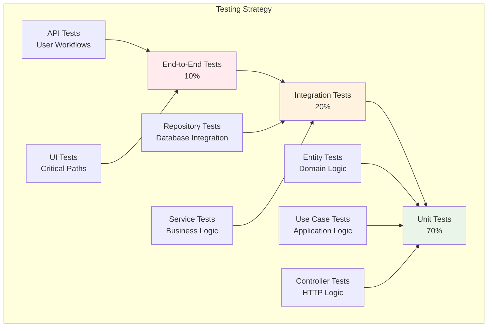

## 8. Deployment Architecture

### Current vs. Target Deployment

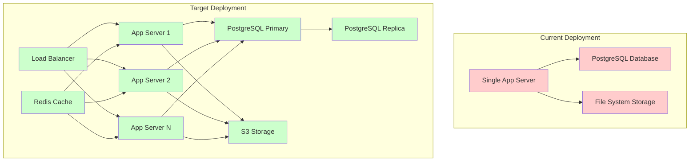

## 9. Error Handling Flow

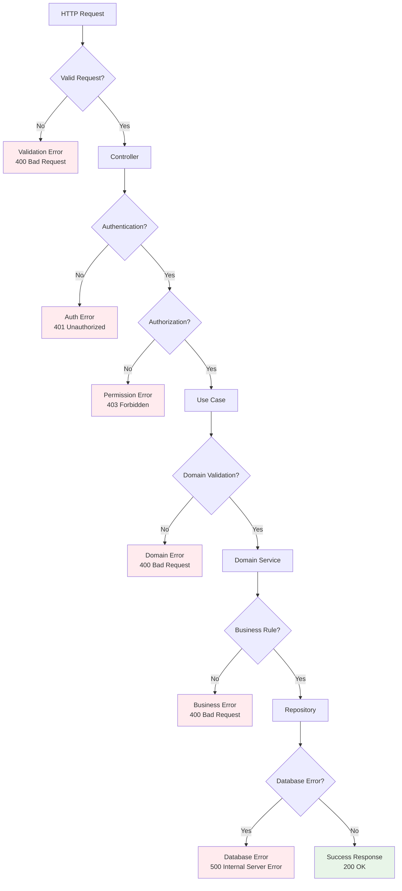

## 10. Performance Monitoring

### Key Metrics Dashboard

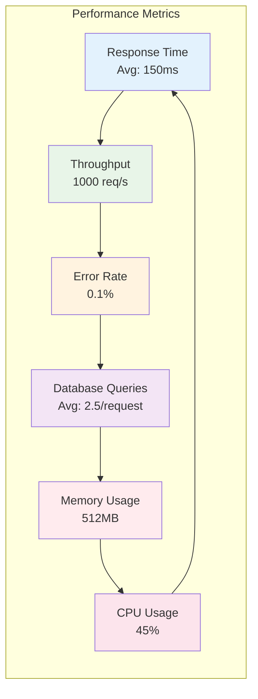

## Summary

These diagrams provide multiple perspectives on the Clean Architecture implementation:

1. **High-Level Overview**: Shows the transformation from current to target architecture
2. **Layer Details**: Explains the structure and responsibilities of each layer
3. **Component Interactions**: Demonstrates how components communicate
4. **Database Evolution**: Shows schema improvements over time
5. **Dependency Injection**: Illustrates how dependencies are managed
6. **Migration Strategy**: Provides a timeline for implementation
7. **Testing Strategy**: Shows the testing pyramid approach
8. **Deployment Architecture**: Compares current vs. target deployment
9. **Error Handling**: Demonstrates comprehensive error management
10. **Performance Monitoring**: Shows key metrics to track

These visualizations will help you understand the architecture at different levels and execute the implementation plan effectively.
